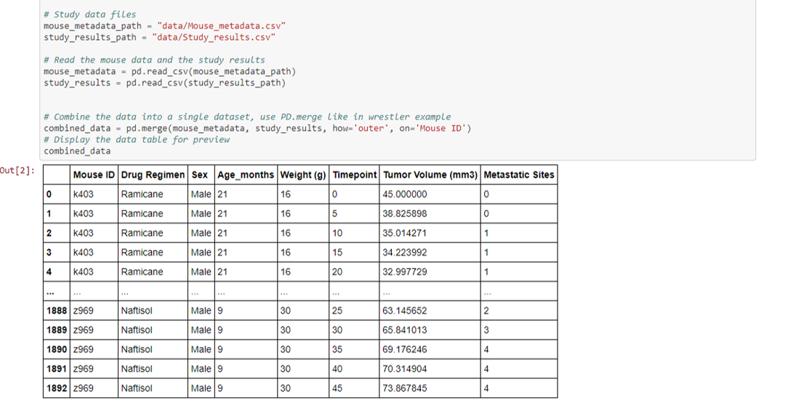
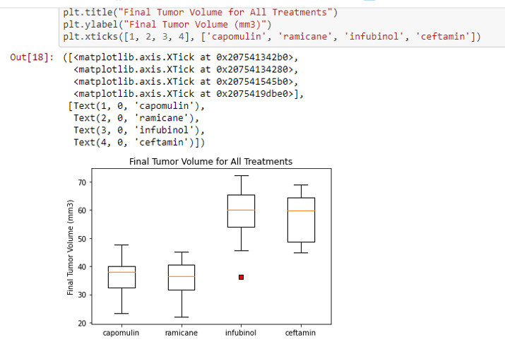
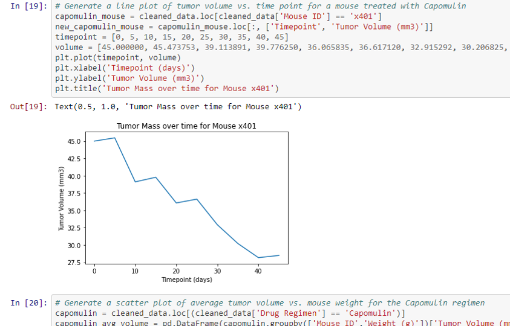
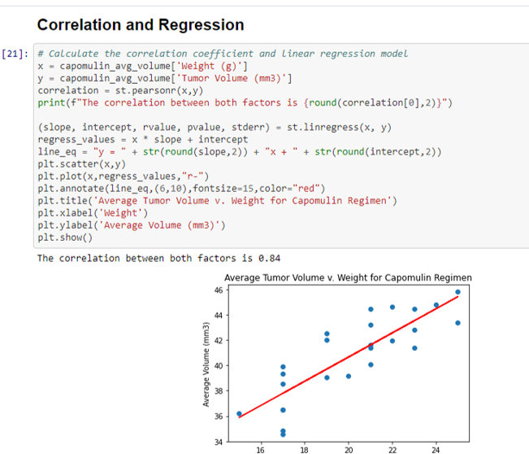

# Plotting with Matplotlib

I was tasked with analyzing data from study of tumor growth in mice that were treated with a variety of drug regimen and creating tables and figures to show results. 

## Data Cleaning

I decided to use Python and supportive libraries for analysis. Starting out I created a jupyter notebook so I could import data and create new dataframes for analysis. I imported my dependencies and csv files so I could merge my two files (pictured below). 

## Data Analysis

Once I cleaned my data I was able to create different plots using matplotlib and create summary statistics to show the effectiveness of all the drug regimen against tumor growth in mice. Pictured below I have the quartiles, median, and IQR listed from Infubinol, Ramicane, Ceftamin, and Capomulin.

Taking a closer look into Capomulin, I targeted a specific Mouse Id and wanted to see the Tumor mass over time. Over 40 days, Mouse x401 tumor mass went from 45mm^3 to 29mm^3. Showing that Capomulin was highly effective. 

Taking a closer look into Capolulin I wanted to looking into correlation and regression on that specific drug regimen.  Using matplotlib, I created a chart and calculation to find results.

Contact -
mattweiper@gmail.com
